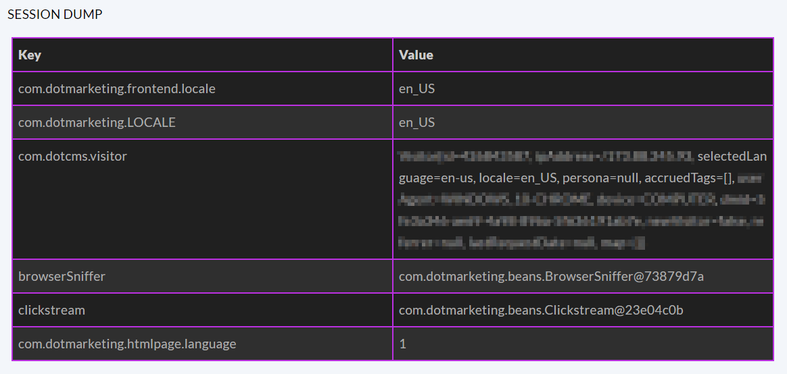
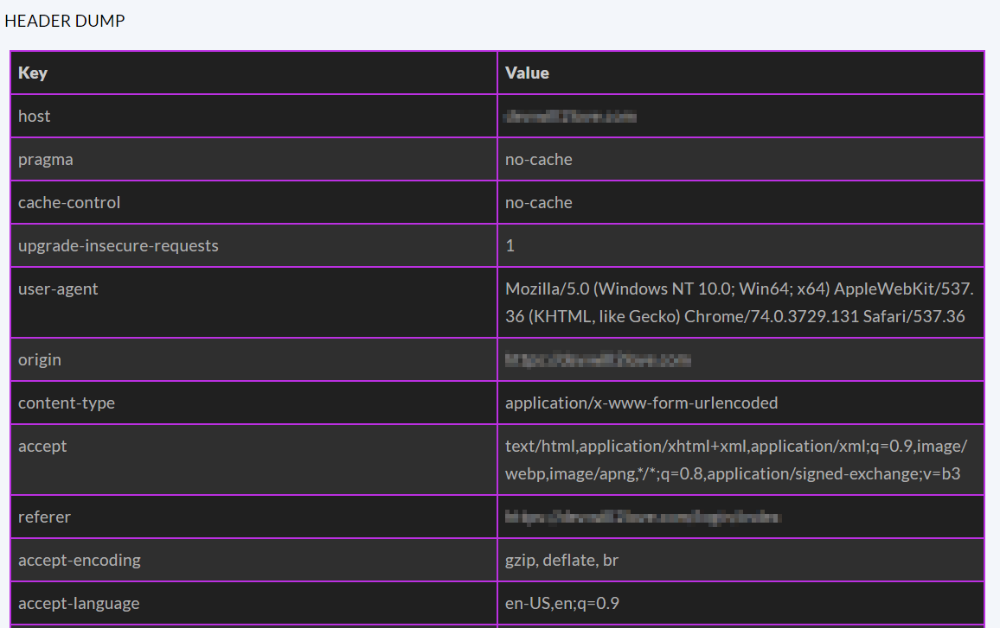
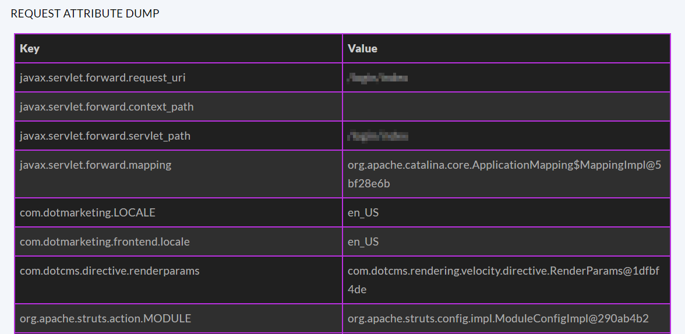

# Macros

# Index

1. [Button Generator](#button-generator)
1. [Container Info](#container-info)
1. [Contentlet Info](#contentlet-info)
1. [Header Dump](#header-dump)
1. [Session Dump](#session-dump)
1. [Velocity Context Dump](#context-dump)
1. [JSON Get](#json-get)
1. [Slugify](#slugify)
1. [](#truncate-string)

> Note: When installing macro files (.vm), be sure to reference them somewhere. It is recommended to use a standalone Script Initializer container and reference it with `#parseContainer()` in the top of your theme or advanced template.

<a name="button-generator"></a>

## Button Generator

### Description

Creates a custom field that allows most attributes to be applied to an anchor or button element without the need to write the HTML or waste multiple fields.

### Installation

1. Upload `/macros/button.vm` to `/application/macros`
1. Upload `/custom-fields/field-button.vtl` to `/application/custom-fields`
1. Create a custom field with the following value:
```
#dotParse('/application/custom-fields/field-button.vtl')
```


### Usage


Where the button is to be used in Velocity, invoke: `#GenerateButton($contentlet.fieldName)`

---

<a name="container-info"></a>

## Container Info

### Description

Provides extra container information in the dotCMS Page Preview

### Installation

1. Upload `/macros/container-info.vm` to `/application/macros`

### Usage

1. Place this macro reference in the `Pre Loop` field in your container: `#ContainerInfo()`


---

<a name="contentlet-info"></a>

## Contentlet Info

Provides extra contentlet information in the dotCMS Page Preview

### Installation

1. Upload `/macros/contentlet-info.vm` to `/application/macros`
1. Upload `/macros/css/edit-mode.css` to `/application/util/css`, or change the CSS reference
1. `#dotParse()` the macro file in a global container, or in a template/theme file
1. Add the following Velocity in the theme where this will be used:

```
#if ($EDIT_MODE)
<link rel="stylesheet" href="//hostname/application/util/css/edit-mode.css">
#end
```

### Usage

1. Invoke the macro with `#ContentletInfo($contentletObject)`


---

<a name="session-dump"></a>

## Session Dump

Displays a table of session data from dotCMS

### Installation

1. Upload `/macros/session-dump.vm` to `/application/macros`
1. Upload `/macros/css/dump-table.css` to `/application/util/css`, or change the CSS reference
1. `#dotParse()` the macro file in a global container, or in a template/theme file

### Usage

1. Invoke the macro with `#SessionDump()`



---

<a name="header-dump"></a>

## Header Dump

Displays a table of HTTP header attributes and HTTP request data from dotCMS

### Installation

1. Upload `/macros/header-dump.vm` to `/application/macros`
1. Upload `/macros/css/dump-table.css` to `/application/util/css`, or change the CSS reference
1. `#dotParse()` the macro file in a global container, or in a template/theme file

### Usage

1. Invoke the macro with `#HeaderDump()`





---

<a name="velocity-context"></a>

## Velocity Context Dump

Displays a table of the current Velocity Context from dotCMS

### Installation

1. Upload `/macros/velocity-context.vm` to `/application/macros`
1. Upload `/macros/css/dump-table.css` to `/application/util/css`, or change the CSS reference
1. `#dotParse()` the macro file in a global container, or in a template/theme file

### Usage

1. Invoke the macro with `#VelocityContext()`


---


<a name="json-get"></a>

## JSON Get

### Description

Utility macro for pulling in remote JSON text, and replaces null values with falsy values. This is a workaround since `org.apache.velocity.tools.view.tools.ImportTool` interprets `null` as a string, and this is no bueno.

### Installation

1. Upload `/macros/json-get.vm` to `/application/macros`

### Usage

Invoke `#GetData($url, $parameters)` using the following syntax:

```
#set ($myVar = $json.generate("#GetData('/path/to/endpoint', $yourparams)"))
```

You will end up with either `com.dotmarketing.util.json.JSONArray` or `com.dotmarketing.util.json.JSONObject`. Calling #GetData() directly into a variable without `$json.generate()` will result in `java.lang.String`. Use it however you like :)


---

<a name="slugify"></a>

## Slugify

### Description

In goes a string, out comes kebab-case text.

### Installation

1. Upload `/macros/sligify.vm` to `/application/macros`

### Usage

Invoke: `#slugify($string)`


---

<a name="truncate-string"></a>

## Friendly Truncate String

### Description

Truncates a string in an grammaticly friendly way, with a char and word limit.


### Installation

1. Upload `/macros/truncate-string.vm` to `/application/macros`

### Usage

Invoke: `#friendlyTruncateString($string $wordLimit $charlimit)`